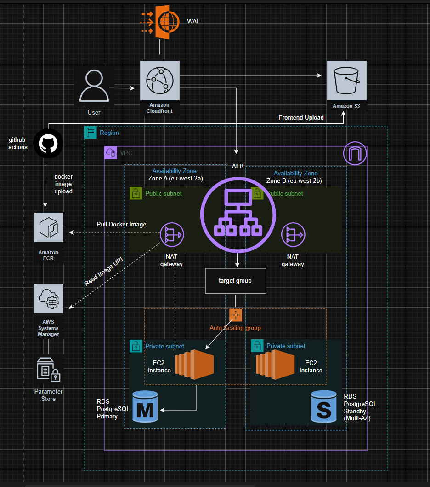

# Production Cloud Platform

Production-style AWS cloud platform demonstrating Infrastructure as Code, automated CI/CD, environment promotion, containerised application deployment, security enforcement, monitoring, and operational governance.

The platform hosts a containerised demo banking application using Amazon EC2 Auto Scaling Groups, Application Load Balancers, Amazon RDS PostgreSQL, CloudFront, AWS WAF, Terraform, and GitHub Actions.

---

# Architecture

## Production AWS Architecture




# Project Overview

This project was designed to simulate a real-world cloud infrastructure environment while applying modern DevOps and Cloud Engineering practices.

The platform demonstrates:

* Infrastructure as Code using Terraform
* Separate Development and Production environments
* Automated CI/CD pipelines
* GitHub OIDC authentication
* Container image vulnerability scanning
* Auto Scaling application infrastructure
* Multi-AZ database deployment
* CloudFront content delivery
* AWS WAF protection
* Monitoring and alerting
* Terraform drift detection
* Production deployment approval gates

---

# Technology Stack

| Category                       | Technology                          |
| ------------------------------ | ----------------------------------- |
| Cloud Provider                 | AWS                                 |
| Infrastructure as Code         | Terraform                           |
| CI/CD                          | GitHub Actions                      |
| Containerisation               | Docker                              |
| Compute                        | Amazon EC2 Auto Scaling             |
| Load Balancing                 | Application Load Balancer           |
| CDN                            | Amazon CloudFront                   |
| Database                       | Amazon RDS PostgreSQL               |
| Container Registry             | Amazon ECR                          |
| Object Storage                 | Amazon S3                           |
| Edge Security                  | AWS WAF                             |
| Authentication                 | GitHub OIDC                         |
| Deployment Configuration Store | AWS Systems Manager Parameter Store |
| Remote Access                  | AWS Systems Manager Session Manager |
| Monitoring                     | Amazon CloudWatch                   |
| Alerting                       | Amazon SNS                          |

---

# Production Environment

The production environment is deployed across multiple Availability Zones and follows a highly available architecture.

### Networking

* Custom VPC
* Internet Gateway
* Two Availability Zones
* Two Public Subnets
* Two Private Subnets
* NAT Gateway per Availability Zone

### Application Layer

* Application Load Balancer
* Target Group
* EC2 Auto Scaling Group
* Dockerised FastAPI Application

### Data Layer

* Amazon RDS PostgreSQL
* Multi-AZ Deployment
* Primary Database Instance
* Standby Database Instance

### Content Delivery

* Amazon CloudFront
* Amazon S3 Frontend Hosting
* AWS WAF Protection

### Operations

* Amazon ECR Container Registry
* AWS Systems Manager Parameter Store
* AWS Systems Manager Session Manager
* CloudWatch Monitoring
* SNS Alerting

---

# Development Deployment Flow

```text
                    Developer
                        │
                        ▼
                  Push to Dev
                        │
                        ▼

 ┌─────────────────────────────────────────┐
 │                                         │
 ▼                 ▼                 ▼

App CI/CD     Frontend CI/CD    Infra CI/CD

 │                 │                 │
 ▼                 ▼                 ▼

Docker Build    S3 Sync        Terraform Apply
Trivy Scan      CloudFront     Terraform Deploy
ECR Push        Invalidation

 └─────────────────────────────────────────┘
                        │
                        ▼

             Development Environment
```

---

# Production Deployment Flow

```text
                    Developer
                        │
                        ▼
                Pull Request
                 (dev → main)
                        │
                        ▼

             Production Validation

         Terraform Validate & Plan
                Checkov Scan
                 Trivy Scan

                        │
                        ▼

              Manual Approval Gate

                        │
                        ▼

 ┌─────────────────────────────────────────┐
 │                                         │
 ▼                 ▼                 ▼

Prod App      Prod Frontend      Prod Infra
 CI/CD           CI/CD            CI/CD

 │                 │                 │
 ▼                 ▼                 ▼

ECR Push        S3 Sync        Terraform Apply
SSM Update      CloudFront     Infrastructure
ASG Refresh     Invalidation     Changes

 └─────────────────────────────────────────┘
                        │
                        ▼

             Production Environment
```

---

# Security Controls

## GitHub OIDC Authentication

The platform uses GitHub OpenID Connect (OIDC) to authenticate GitHub Actions workflows with AWS.

Benefits include:

* No long-lived AWS access keys
* Temporary credentials
* IAM role assumption
* Secure CI/CD authentication
* Reduced credential management overhead

---

## Container Security

Container images are scanned using Trivy during deployment.

The pipeline:

1. Builds the Docker image
2. Performs vulnerability scanning
3. Fails deployments on Critical vulnerabilities
4. Pushes approved images to Amazon ECR

---

## Network Security

Security controls include:

* Private EC2 instances
* Private RDS deployment
* Security Group segmentation
* No public database access
* Session Manager access instead of SSH

---

## Edge Security

Public traffic is protected using:

* AWS WAF
* CloudFront
* Private S3 bucket
* Origin Access Control (OAC)

---

# Deployment Configuration Store

AWS Systems Manager Parameter Store is used to store the currently approved container image URI for each environment.

Deployment workflow:

1. GitHub Actions builds and scans the Docker image.
2. The image is pushed to Amazon ECR.
3. GitHub Actions updates the image URI stored in Parameter Store.
4. An Auto Scaling Group instance refresh is triggered.
5. EC2 instances retrieve the image URI from Parameter Store.
6. EC2 instances pull the approved image from Amazon ECR.

This approach separates infrastructure deployments from application deployments and allows application versions to be updated without modifying Terraform infrastructure code.

---

# Monitoring and Alerting

The platform includes operational monitoring using Amazon CloudWatch and Amazon SNS.

### CloudWatch Alarms

Implemented alarms include:

* High EC2 CPU Utilisation
* ALB Unhealthy Host Detection

### SNS Integration

SNS provides notification capabilities for operational events and CloudWatch alarms.

---

# Drift Detection

Terraform drift detection is implemented through GitHub Actions.

The workflow:

1. Retrieves Terraform state
2. Executes Terraform Plan
3. Detects infrastructure drift
4. Reports deviations from source-controlled infrastructure

This helps ensure deployed infrastructure remains aligned with Terraform definitions.

---

# Screenshot Evidence

## Architecture

* Production Architecture Diagram
* GitHub CI/CD Promotion Flow

## Development Environment

* Frontend Application
* API Connectivity
* Auto Scaling Group
* Target Group Health
* RDS PostgreSQL
* CloudFront Distribution
* ECR Repository
* CloudWatch Alarms
* SNS Topic

## Production Environment

* Frontend Application
* API Connectivity
* Auto Scaling Group
* Target Group Health
* Multi-AZ RDS
* CloudFront Distribution
* ECR Repository
* CloudWatch Alarms
* SNS Topic

## Security & Governance

* GitHub OIDC Authentication
* Terraform Remote State
* Parameter Store
* AWS WAF
* Production Approval Gates
* Drift Detection

## CI/CD

* Development Pipelines
* Production Validation
* Production Infrastructure Deployment
* Production Application Deployment
* Production Frontend Deployment

---

# Repository Structure

```text
production-cloud-platform/

├── app/
│   ├── backend/
│   └── frontend/
│
├── bootstrap/
│   └── backend-resources/
│
├── environments/
│   ├── dev/
│   └── prod/
│
├── modules/
│   ├── alb/
│   ├── compute/
│   ├── ecr/
│   ├── github_oidc/
│   ├── networking/
│   ├── rds/
│   ├── security/
│   └── waf/
│
├── screenshots/
│   ├── 01-architecture/
│   ├── 02-dev-environment/
│   ├── 03-prod-environment/
│   ├── 04-oidc-authentication/
│   ├── 05-terraform-remote-state/
│   ├── 06-ssm-deployment-configuration-store/
│   ├── 07-waf-security/
│   ├── 08-cicd-pipelines/
│   ├── 09-production-approvals/
│   └── 10-drift-detection/
│
└── .github/
    └── workflows/
```

---

# Key Features Demonstrated

* Terraform Infrastructure as Code
* Modular Terraform Design
* Multi-Environment Architecture
* GitHub Actions CI/CD
* GitHub OIDC Authentication
* Docker Container Deployment
* Amazon ECR Integration
* Systems Manager Parameter Store Integration
* EC2 Auto Scaling Groups
* Application Load Balancers
* Multi-AZ RDS PostgreSQL
* CloudFront Content Delivery
* AWS WAF Protection
* CloudWatch Monitoring
* SNS Alerting
* Terraform Drift Detection
* Production Approval Gates

---

# Future Enhancements

Potential future improvements include:

* Route 53 DNS integration
* ACM certificates and custom domain
* Blue/Green deployments
* Automated rollback strategy
* Centralised logging
* AWS Config compliance monitoring
* VPC Endpoints for ECR and S3
* Container orchestration with Amazon EKS

---

## Author

**Tayyab Khalid**

Cloud & DevOps Portfolio Project

AWS • Terraform • GitHub Actions • Docker • Cloud Engineering • DevOps
